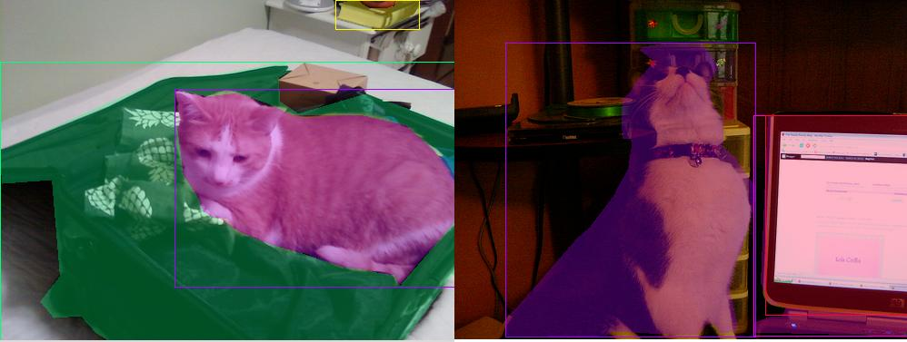

# Local COCO Viewer

> Simple COCO Objects Viewer in Tkinter. Allows quick viewing on local machine.



## Requirements
`python3` `PIL`

## Installation

```
git clone https://github.com/trsvchn/local-coco-viewer.git
```

## Usage

```bash
python cocoviewer.py -h

usage: cocoviewer.py [-h] [-i PATH] [-a PATH]

View images with bboxes from COCO dataset

optional arguments:
  -h, --help                    show this help message and exit
  -i PATH, --images PATH        path to images folder
  -a PATH, --annotations PATH   path to annotations json file
```

## Example:

```bash
python cocoviewer.py -i coco/images/val/val2017 -a coco/annotations/val/instances_val2017.json
```
