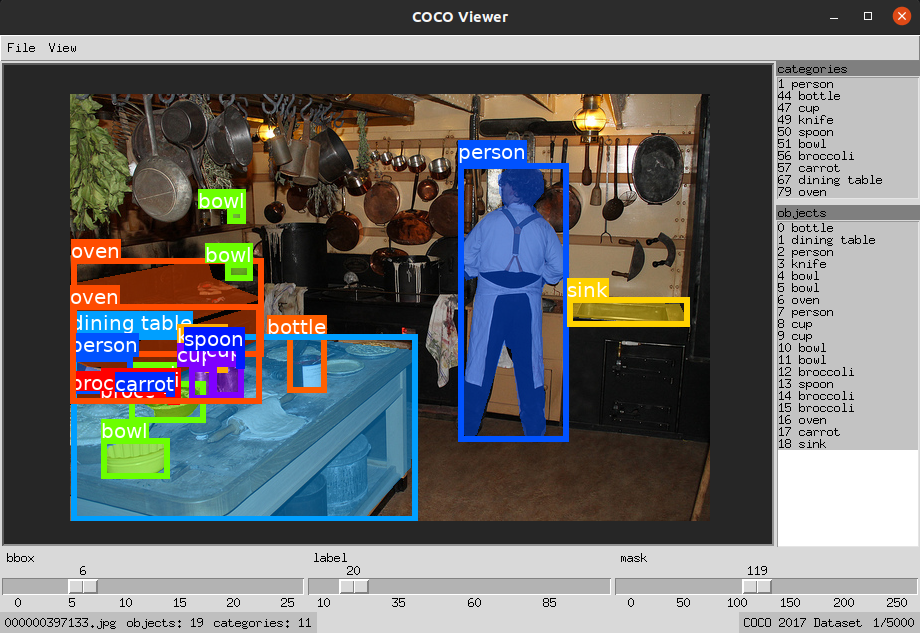

# COCO Viewer

Simple COCO Objects Viewer in Tkinter. Allows quick viewing on local machine.



## Keyboard Shortcuts

| Key | Action |
|:-:|:-:|
| <kbd>→</kbd>, <kbd>J</kbd> | Next Image |
| <kbd>←</kbd>, <kbd>K</kbd> | Previous Image |
| <kbd>L</kbd>, <kbd>Ctrl</kbd> + <kbd>L</kbd> | Toggle **L**abels |
| <kbd>B</kbd>, <kbd>Ctrl</kbd> + <kbd>B</kbd> | Toggle **B**oxes |
| <kbd>M</kbd>, <kbd>Ctrl</kbd> + <kbd>M</kbd> | Toggle **M**asks |
| <kbd>Ctrl</kbd> + <kbd>S</kbd> | Save Current Image |
| <kbd>Ctrl</kbd> + <kbd>Q</kbd>, <kbd>Ctrl</kbd> + <kbd>W</kbd> | Exit Viewer |

## Requirements
`python3` `PIL`

## Installation

```
git clone https://github.com/trsvchn/coco-viewer.git
```

## Usage

```bash
python cocoviewer.py -h

usage: cocoviewer.py [-h] [-i PATH] [-a PATH]

View images with bboxes from the COCO dataset

optional arguments:
  -h, --help                    show this help message and exit
  -i PATH, --images PATH        path to images folder
  -a PATH, --annotations PATH   path to annotations json file
```

## Example:

```bash
python cocoviewer.py -i coco/images/val/val2017 -a coco/annotations/val/instances_val2017.json
```
